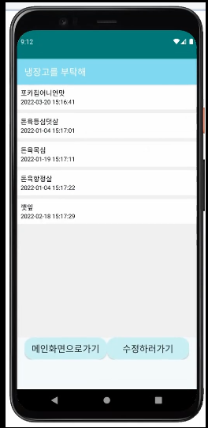

# 냉장고를 부탁해

##  프로젝트 아이디어 및 배경
- 아이디어 
    - 사용자가 물건을 사고 받은 **영수증** 과 **음식의 사진**을 통하여 객체를 분류하고 그에 맞는 유통기한을 편하게 저장하게 하여 버리는 음식을 줄이고 냉장고 관리를 편하게 하기 위한 어플리케이션   
      
    - 사람들의 평소의 식습관, 음식 소비관련 데이터 또한 수집하여 새로운 데이터 창출 가능 

    - 영수증의 글자를 잘 못 분류하였을때 그 데이터를 저장하여 모델 재학습에 사용하는 것 또한 목표

- 배경 
    - 2021.06 전반기 졸업작품을 제출을 위한 목적으로 시작된 프로젝트
    - 개인적인 심층신경망의 분류문제에 대한 호기심

-------------------------------

## 실행화면 

gif 이미지는 로딩 시간이 조금 거릴 수 있습니다.

- 개발 환경 : Android Studio 사용
- 효율적인 detection을 위하여 유저에게 인식이 필요한 부분을 crop 할 수 있도록 한다.
- 다른 동작들은 reffri를 실행하여 확인할 수 있다. (회원 서버는 실행해 놓고 있지 않아 따로 구축해야함)

--------------------------------
## 기능 
- 로그인 / 회원가입
- 영수증 & 식자제 
    - 사진을 찍은 후 or 갤러리의 사진을 선택한 후 전송
    - 이미지에 맞는 상품이름과 유통기한을 OCR model과 object claffication model을 이용하여 사용자에게 전송
    - 현재시간 이후 유통기한이 지나면 알람
    - 틀린 상품이름이 올 경우 고칠 수 있고 , 틀린 경우는 다시 서버에 전송됨
 - 냉장고 자제 관리 
    - 자제이름 + 유통기한 추가 삭제 수정 가능
    - 영수증 혹은 식자재 이미지로 얻은 상품이름과 유통기한 또한 이곳에 저장됨
---------------------------------
## ko-OCR
- socket 통신을 통한 연결 => 사용자에게 이미지를 전달받음 => img_preprocessing => Detection => 문자이미지 segmentaiton 이후 crop => model을 통한 분류
 - Detecting이 잘되지 않는 특정 단어들 (깻잎,등심 등을 찾아 추가로 데이터셋에 넣어주었습니다.)
 - 모델에 대한 전체적인 코드는  https://github.com/parksunwoo/ocr_kor 리포지토리를 따릅니다.
---------------------------------

## classfication food
- 상품 사진으로 상품명과 유통기한을 식별하는 프로그램
[카메라 기반 상품 인식 시스템 개발](https://github.com/mu-in/muin_DL)에서의 pretrined efficient net을 사용하였습니다.

----------------------------------
## 유통기한 데이터 

- Selenium을 통한  동적 크롤링
- tag를 활용하여 상품명과 유통기한을 받아 dict형태로 만들고 pkl파일로 저장
- http://www.foodsafetykorea.go.kr/portal/specialinfo/searchInfoProduct.do?menu_grp=MENU_NEW04&menu_no=2815#page1

---------------------------------
아쉬운점 
- 서버들(ko-ocr,food_classfication,회원서버)의 데이터베이스를 합치지 못한것
- 심층신경망에 대한 공부가 부족하여 제대로 이해하지 못하고 실제 있는 코드를 응용하여 데이터셋만 변경한 점
- 식자재 사진 분류는 데이터셋이 부족하여 제대로 동작하지 않는다.  데이터셋에 있는 특정 브랜드의 식자재 사진만 가능하고 또한 제대로 찍히지 않으면 잘 동작하지 않는다.  
- ocr 속도가 느린점 (약 30초 소요)가 실용성이 떨어져 보인다.

--------------------------------
배운점
- 안드로이드 스튜디오 activity 개념
- 심층신경망 모델에서 데이터에 따라 성능 향상 폭이 크다 (깻잎, 등심등을 추가로 학습하였을 때 더 좋은 학습성능을 더 보였고, 노이즈 추가와 같은 data augmentation 또한 도움이 된듯하다.)
- selenium 동적 크롤링 방법
- 이미지 전처리의 방법들 (노이즈 줄이기, affine 변환 , 이미지를 중심에 가져다 두기 등)

